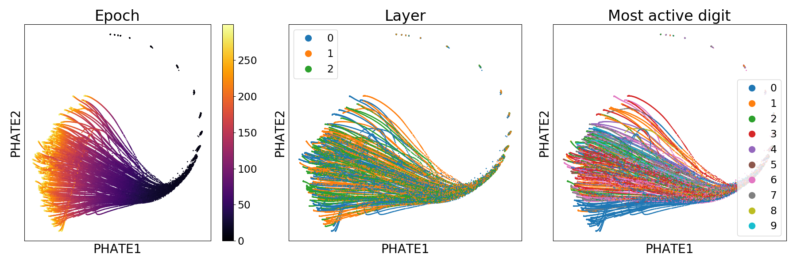
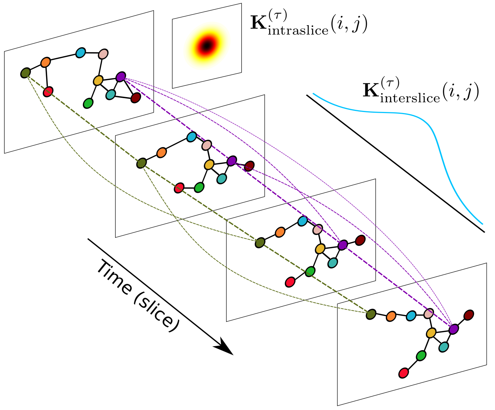
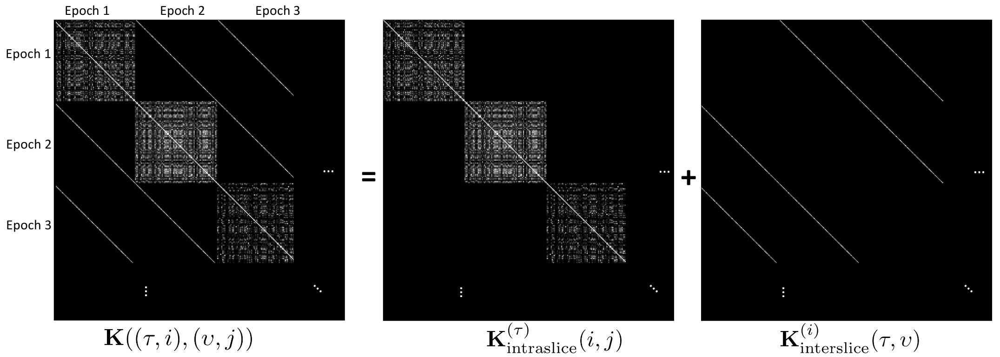

# M-PHATE

[](https://pypi.org/project/m-phate/)
[](https://travis-ci.com/scottgigante/m-phate)
[](https://coveralls.io/github/scottgigante/m-phate?branch=master)
[](https://arxiv.org/abs/xxxx.xxxx)
[](https://twitter.com/scottgigante)
[](https://github.com/scottgigante/M-PHATE/)



Multislice PHATE (M-PHATE) is a dimensionality reduction algorithm for the visualization of time-evolving data. To learn more about M-PHATE, you can read our preprint on arXiv in which we apply it to the evolution of neural networks over the course of training. Above we show a demonstration of M-PHATE applied to a 3-layer MLP over 300 epochs of training, colored by epoch (left), hidden layer (center) and the digit label that most strongly activates each hidden unit (right). Below, you see the same network with dropout applied in training embedded in 3D, also colored by most active unit.


### Table of Contents

* [How it works](#How-it-works)
* [Installation](#Installation)
* [Usage](#Usage)
  * [Basic Usage Example](#Basic-usage-example)
  * [Network Training](#Network-training)
* [Parameter Tuning](#Parameter-tuning)
* [Figure Reproduction](#Figure-reproduction)
* [Help](#Help)

## How it works

Multislice PHATE (M-PHATE) combines a novel multislice kernel construction with the [PHATE visualization](https://github.com/KrishnaswamyLab/PHATE). Our kernel captures the dynamics of an evolving graph structure, that when when visualized, gives unique intuition about the evolution of a system; in our preprint on arXiv, we show this applied to a neural network over the course of training and re-training. We compare M-PHATE to other dimensionality reduction techniques, showing that the combined construction of the multislice kernel and the use of PHATE provide significant improvements to visualization. In two vignettes, we demonstrate the use M-PHATE on established training tasks and learning methods in continual learning, and in regularization techniques commonly used to improve generalization performance.

The multislice kernel used in M-PHATE consists of building graphs over time slices of data (e.g. epochs in neural network training) and then connecting these slices by connecting each point to itself over time, weighted by its similarity. The result is a highly sparse, structured kernel which provides insight into the evolving structure of the data.





## Installation

### Install from `pypi`

```
pip install --user m-phate
```

### Install from source

```
pip install --user git+https://github.com/scottgigante/m-phate.git
```

## Usage

### Basic usage example

Below we apply M-PHATE to simulated data of 50 points undergoing random motion.

```
import numpy as np
import m_phate
import scprep

# create fake data
n_time_steps = 100
n_points = 50
n_dim = 25
np.random.seed(42)
data = np.cumsum(np.random.normal(0, 1, (n_time_steps, n_points, n_dim)), axis=0)

# embedding
m_phate_op = m_phate.M_PHATE()
m_phate_data = m_phate_op.fit_transform(data)

# plot
time = np.repeat(np.arange(n_time_steps), n_points)
scprep.plot.scatter2d(m_phate_data, c=time, ticks=False, label_prefix="M-PHATE")
```


### Network training

To apply M-PHATE to neural networks, we provide helper classes to store the samples from the network during training. In order to use these, you must install [`tensorflow`](https://www.tensorflow.org/install) and [`keras`](https://keras.io/#installation).

```
import numpy as np

import keras
import scprep

import m_phate
import m_phate.train
import m_phate.data

# load data
x_train, x_test, y_train, y_test = m_phate.data.load_mnist()

# select trace examples
trace_idx = [np.random.choice(np.argwhere(y_test[:, i] == 1).flatten(),
                              10, replace=False)
             for i in range(10)]
trace_data = x_test[np.concatenate(trace_idx)]

# build neural network
lrelu = keras.layers.LeakyReLU(alpha=0.1)
inputs = keras.layers.Input(
    shape=(x_train.shape[1],), dtype='float32', name='inputs')
h1 = keras.layers.Dense(128, activation=lrelu, name='h1')(inputs)
h2 = keras.layers.Dense(128, activation=lrelu, name='h2')(h1)
h3 = keras.layers.Dense(128, activation=lrelu, name='h3')(h2)
outputs = keras.layers.Dense(10, activation='softmax', name='output_all')(h3)

# build trace model helper
model_trace = keras.models.Model(inputs=inputs, outputs=[h1, h2, h3])
trace = m_phate.train.TraceHistory(trace_data, model_trace)

# compile network
model = keras.models.Model(inputs=inputs, outputs=outputs)
model.compile(optimizer='adam', loss='categorical_crossentropy',
              metrics=['categorical_accuracy', 'categorical_crossentropy'])

# train network
model.fit(x_train, y_train, batch_size=128, epochs=200,
          verbose=1, callbacks=[trace],
          validation_data=(x_test,
                           y_test))

# extract trace data
trace_data = np.array(trace.trace)
epoch = np.repeat(np.arange(trace_data.shape[0]), trace_data.shape[1])

# apply M-PHATE
m_phate_op = m_phate.M_PHATE()
m_phate_data = m_phate_op.fit_transform(trace_data)

# plot the result
scprep.plot.scatter2d(m_phate_data, c=epoch, ticks=False,
                      label_prefix="M-PHATE")
```

For detailed examples, see our sample notebooks in `keras` and `tensorflow` in [`examples`](https://github.com/scottgigante/m-phate/tree/master/examples):

* Keras
  * [Classifier](https://nbviewer.jupyter.org/github/scottgigante/m-phate/blob/master/examples/classification_keras.ipynb)
  * [Autoencoder](https://nbviewer.jupyter.org/github/scottgigante/m-phate/blob/master/examples/autoencoder_keras.ipynb)
* Tensorflow
  * [Classifier](https://nbviewer.jupyter.org/github/scottgigante/m-phate/blob/master/examples/classification_tensorflow.ipynb)
  * [Autoencoder](https://nbviewer.jupyter.org/github/scottgigante/m-phate/blob/master/examples/autoencoder_tensorflow.ipynb)

## Parameter tuning

The key to tuning the parameters of M-PHATE is essentially balancing the tradeoff between interslice connectivity and intraslice connectivity. This is primarily achieved with `interslice_knn` and `intraslice_knn`. You can see an example of the effects of parameter tuning in [this notebook](https://nbviewer.jupyter.org/github/scottgigante/m-phate/blob/master/examples/parameter_tuning.ipynb).

## Figure reproduction

We provide scripts to reproduce all of the empirical figures in the preprint. 

To run them:

```
git clone https://github.com/scottgigante/m-phate
cd m-phate
pip install --user .
DATA_DIR=~/data/checkpoints/m_phate # change this if you want to store the data elsewhere

chmod +x scripts/generalization/generalization_train.sh
chmod +x scripts/task_switching/classifier_mnist_task_switch_train.sh

./scripts/generalization/generalization_train.sh $DATA_DIR
./scripts/task_switching/classifier_mnist_task_switch_train.sh $DATA_DIR

python scripts/demonstration_plot.py $DATA_DIR
python scripts/comparison_plot.py $DATA_DIR
python scripts/generalization_plot.py $DATA_DIR
python scripts/task_switch_plot.py $DATA_DIR

# generalization plot using training data
./scripts/generalization/generalization_train.sh ${DATA_DIR}/train_data --sample-train-data
mkdir train_data; cd train_data; python -i ../scripts/generalization_plot.py ${DATA_DIR}/train_data; cd ..
```

## TODO

* Provide support for PyTorch
* Notebook examples for:
  * Classification, pytorch
  * Autoencoder, pytorch
* Build readthedocs page
* Update arXiv link

## Help

If you have any questions, please feel free to [open an issue](https://github.com/scottgigante/m-phate/issues).